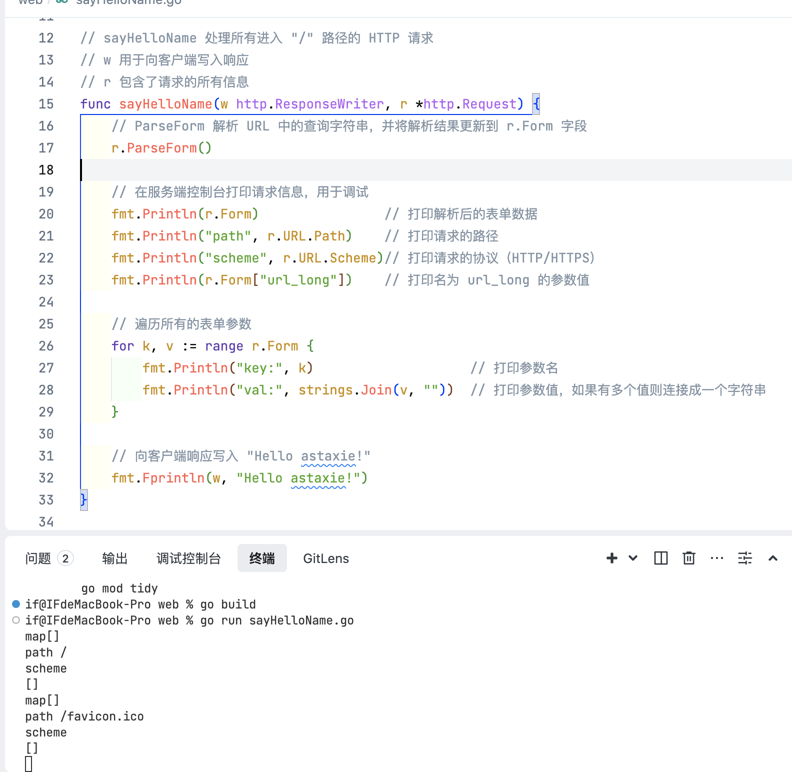
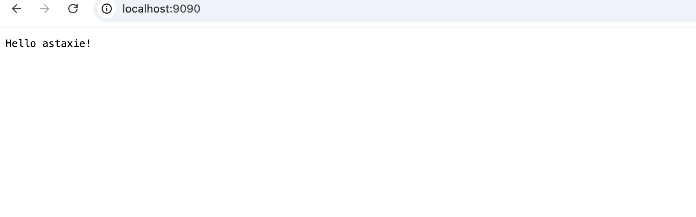

# go如何启动一个简易web服务





代码.md
```
// Package main 是程序的入口包
package main

// 导入需要使用的标准库包
import (
    "fmt"      // 用于打印输出
    "log"      // 用于日志记录
    "net/http" // 提供 HTTP 客户端和服务端的实现
    "strings"  // 提供字符串操作的函数
)

// sayHelloName 处理所有进入 "/" 路径的 HTTP 请求
// w 用于向客户端写入响应
// r 包含了请求的所有信息
func sayHelloName(w http.ResponseWriter, r *http.Request) {
    // ParseForm 解析 URL 中的查询字符串，并将解析结果更新到 r.Form 字段
    r.ParseForm()

    // 在服务端控制台打印请求信息，用于调试
    fmt.Println(r.Form)                // 打印解析后的表单数据
    fmt.Println("path", r.URL.Path)    // 打印请求的路径
    fmt.Println("scheme", r.URL.Scheme)// 打印请求的协议（HTTP/HTTPS）
    fmt.Println(r.Form["url_long"])    // 打印名为 url_long 的参数值

    // 遍历所有的表单参数
    for k, v := range r.Form {
        fmt.Println("key:", k)                    // 打印参数名
        fmt.Println("val:", strings.Join(v, ""))  // 打印参数值，如果有多个值则连接成一个字符串
    }

    // 向客户端响应写入 "Hello astaxie!"
    fmt.Fprintln(w, "Hello astaxie!")
}

func main() {
    // 注册路由处理函数，将根路径 "/" 的请求交给 sayHelloName 函数处理
    http.HandleFunc("/", sayHelloName)

    // 启动 HTTP 服务器，监听 9090 端口
    // nil 表示使用默认的 ServeMux 路由器
    err := http.ListenAndServe(":9090", nil)

    // 如果服务器启动失败，记录错误并终止程序
    if err != nil {
        log.Fatal("ListenAndServe:", err)
    }
}


go build + go run


```


